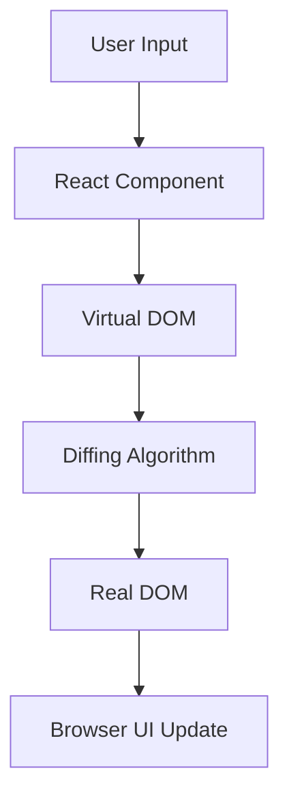

# 1: What is React?

 React is a JavaScript library for building user interfaces, particularly suited for single-page applications (SPAs). It helps developers create interactive, dynamic, and high-performance UIs by using components, declarative programming, 
and a virtual DOM.

Developed and maintained by Meta (formerly Facebook), React is open-source and has become one of the most popular front-end libraries in the web development world.


##  Core Characteristics

| Feature                     | Description |
|----------------------------|-------------|
| Component-Based        | UI is built using small, reusable pieces called components. |
| Declarative            | You describe what the UI should look like, and React updates it automatically. |
| Virtual DOM            | React uses a virtual DOM to update only parts of the UI that have changed. |
| Unidirectional Data Flow | Data flows one way — from parent to child components using `props`. |
| JSX Syntax             | HTML-like syntax used to define UI structure within JavaScript. |


##  Basic Architecture Diagram 



### Explanation:

User Input triggers a state or prop change.

React Component processes the logic.

A new Virtual DOM is created.

The Diffing Algorithm compares it to the previous virtual DOM.

Only changes are applied to the Real DOM, which updates the UI efficiently.

## Example: Basic React Component

```bash
function Welcome(props) {
  return <h1>Hello, {props.name}!</h1>;
}
```

This is a functional component that returns a React element using JSX. It accepts props and renders UI accordingly.


## Why is React Popular?

- High performance using Virtual DOM and selective updates.
- Reusable components reduce code duplication.
- Strong tooling (React DevTools, VSCode support).
- Large ecosystem (React Router, Redux, Next.js).
- Focused on the View — can be used with any backend or state manager.

## Summary

React is a declarative, component-based JavaScript library for building scalable and interactive user interfaces, using a virtual DOM and unidirectional data flow to optimize rendering performance.

