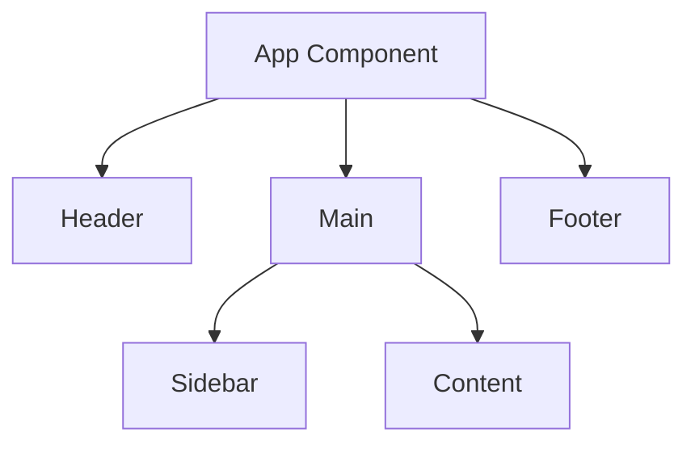

#  React Interview Question 3: What are Components in React?


What are components in React, and why are they important?


Components are the building blocks of a React application. They allow you to split the UI into independent, reusable pieces that can be managed separately.

A component is essentially a JavaScript function or class that:
- Accepts inputs (props)
- Returns React elements (JSX) that describe what should appear on the screen


##  Types of Components

| Type               | Description |
|--------------------|-------------|
| Functional Components | Functions that return JSX. Introduced with Hooks for state and effects. |
| Class Components      | Older syntax using ES6 classes. Have lifecycle methods and `this.state`. |
| Pure Components       | Class components that implement shallow prop/state comparison. |
| Higher-Order Components (HOCs) | Functions that take a component and return a new component. Used for reusability. |


## Basic Examples

### Functional Component

```jsx
function Greeting(props) {
  return <h1>Hello, {props.name}!</h1>;
}
```

### Class Component

```jsx
class Greeting extends React.Component {
  render() {
    return <h1>Hello, {this.props.name}!</h1>;
  }
}
```

## Why Use Components?

- Reusability: Build once, use many times.
- Separation of concerns: Logic and UI kept modular.
- Easy to manage and test.
- Encourages a clean, maintainable project structure.

## Diagrams
### Component Lifecycle (Class-Based)

```mermaid
graph TD
  A[Mounting Phase]
  A1[constructor()] --> A2[render()]
  A2 --> A3[componentDidMount()]

  B[Updating Phase]
  B1[shouldComponentUpdate()] --> B2[render()]
  B2 --> B3[componentDidUpdate()]

  C[Unmounting Phase]
  C --> C1[componentWillUnmount()]

```
React Functional Components use Hooks instead of lifecycle methods.

### Component Tree Example



## Summary

A React component is a self-contained unit that defines part of the UI. It can be composed with other components to build complex UIs efficiently.

- Reusable UI elements
- Can hold state and logic
- The foundation of React apps
