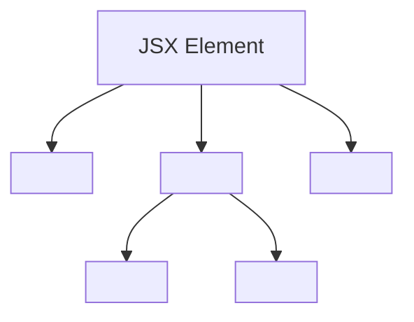

# 4: What is JSX in React?


What is JSX in React and why is it used?
 
JSX (JavaScript XML) is a syntax extension for JavaScript used in React to describe what the UI should look like. It looks similar to HTML but allows you to write React elements in a declarative way within JavaScript code.

 JSX is not a string or HTML; under the hood, it gets compiled to React.createElement() calls that create React elements.

 Why Use JSX?

- Declarative and Readable: Easier to visualize UI structure.
- Tight integration with JavaScript: You can embed expressions directly.
- Prevents Injection Attacks: JSX escapes values to protect against XSS.
- Tooling Support: Editors provide syntax highlighting and error checking.

## Basic JSX Example
```jsx
const element = <h1>Hello, world!</h1>;
```

### This JSX compiles roughly to:

```jsx
const element = React.createElement('h1', null, 'Hello, world!');
```

## Embedding Expressions in JSX

You can embed any JavaScript expression inside curly braces {} within JSX:

```jsx
const name = 'Alice';
const element = <h1>Hello, {name}!</h1>;
```

## JSX is an Expression Too

Because JSX compiles to JavaScript function calls, you can use it anywhere JavaScript expressions are valid:

```jsx
function getGreeting(user) {
  if (user) {
    return <h1>Hello, {user.name}!</h1>;
  }
  return <h1>Hello, Stranger.</h1>;
}
```

## JSX Rules and Best Practices

- JSX elements must have one parent element (wrap with <div>, <React.Fragment>, or <>).
- Use className instead of class for CSS classes.
- Use camelCase for HTML attributes (tabIndex, htmlFor).
- Self-close tags with no children: <input />.

## JSX Tree Example:



## Summary

JSX lets you write UI components in a syntax that looks like HTML but has full power of JavaScript — making React code easier to write and maintain.
