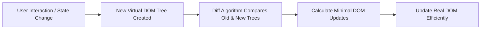

#   5: What is the Virtual DOM

What is the Virtual DOM in React, and why is it important?

##  Answer

The Virtual DOM (VDOM) is a lightweight, in-memory representation of the real DOM elements generated by React components.

Instead of updating the browser's DOM directly, React builds and maintains this virtual version, which allows React to:

- Efficiently determine what changes are needed by diffing the previous and current Virtual DOM trees.
- Batch and minimize actual DOM updates, which are expensive in terms of performance.

##  How Virtual DOM Works
1. When the state or props of a component change, React creates a new Virtual DOM tree.
2. React compares this new Virtual DOM with the previous one using a diffing algorithm.
3. React calculates the minimal set of changes required to update the real DOM.
4. React updates the real DOM only where necessary, improving performance.

## Visualizing the Virtual DOM Process

## Why is the Virtual DOM Important?

- Performance Optimization: Avoids costly direct DOM manipulations.
- Declarative UI: Developers describe what the UI should look like, React handles the updates.
- Cross-platform: The concept allows React Native and other React renderers to work with different platforms.
